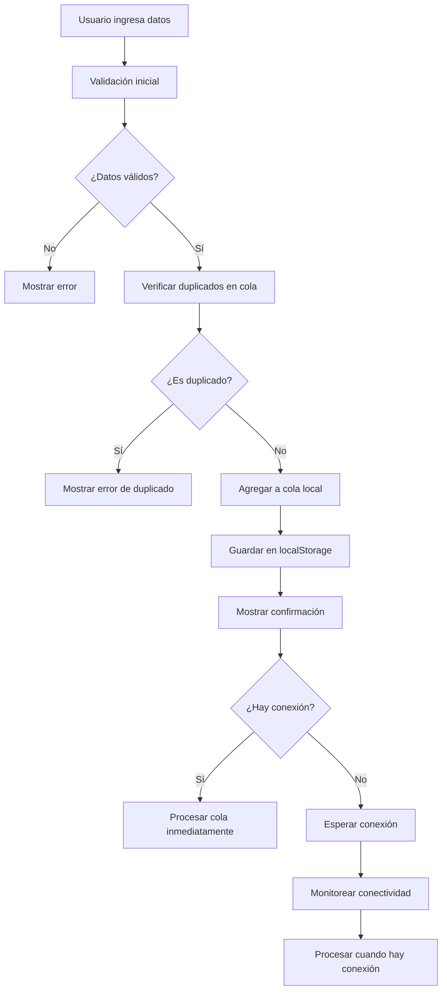
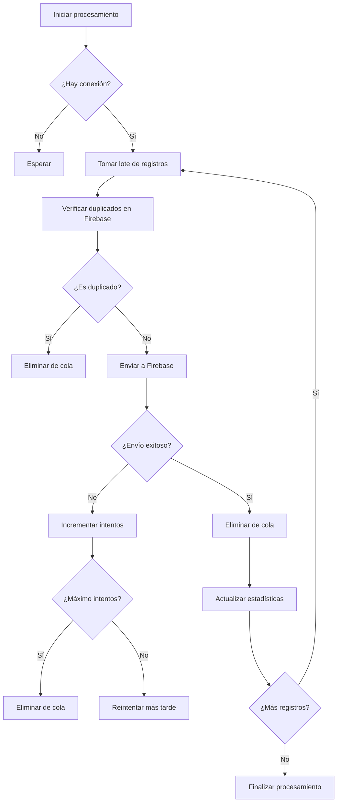

# Sistema de Cola Optimizado para Registro de Personas

## 🎯 Propuesta Implementada

Se ha implementado un sistema de gestión de cola que optimiza el registro de personas, mejorando significativamente la robustez y eficiencia del sistema, especialmente en condiciones de conectividad inestable.

## 🚀 Características Principales

### 1. **Registro y Almacenamiento Local**
- Los registros se guardan inicialmente en una cola local en el dispositivo
- Esperan por una conexión a internet para ser procesados
- Datos persistentes en `localStorage` para evitar pérdida de información

### 2. **Validación Inteligente en Cola**
- Validación completa de datos antes de agregar a la cola
- Verificación de duplicados dentro de la misma cola
- Detección de cédulas ya existentes contra registros enviados/confirmados
- Eliminación automática de registros inválidos o duplicados

### 3. **Monitoreo de Conectividad**
- Detección automática de cambios en la conexión a internet
- Monitoreo continuo del estado de la red
- Procesamiento automático cuando se restablece la conexión

### 4. **Envío Automático Optimizado**
- Procesamiento en lotes para optimizar el rendimiento
- Reintentos automáticos con límite configurable
- Pausas entre lotes para evitar sobrecarga del servidor
- Fallback a almacenamiento local si Firebase no está disponible

## 📋 Funcionamiento del Sistema

### Flujo de Registro Optimizado



### Procesamiento de Cola



## 🔧 Configuración del Sistema

### Parámetros Configurables

```javascript
// En queue-manager.js
this.maxRetries = 3;           // Intentos máximos por registro
this.retryDelay = 5000;        // Delay entre reintentos (5 segundos)
this.batchSize = 5;            // Tamaño del lote de procesamiento
this.autoProcessInterval = 30000; // Intervalo de procesamiento automático (30 segundos)
```

### Validaciones Implementadas

- **Cédula**: 6-10 dígitos numéricos
- **Nombre**: Mínimo 3 caracteres
- **Teléfono**: Formato 04xxxxxxxxx
- **Sexo**: M o F
- **Edad**: 16-120 años
- **UBCH y Comunidad**: Obligatorios

## 📊 Interfaz de Usuario

### Indicador de Estado de Cola

El sistema muestra un indicador visual del estado de la cola:

```html
<div id="queue-status" class="queue-status">
    <div class="queue-info">
        <span class="queue-count">📋 3 en cola</span>
        <span class="queue-status online">🌐 En línea</span>
        <span class="processing">🔄 Procesando...</span>
    </div>
</div>
```

### Estados Visuales

- **📋 X en cola**: Número de registros pendientes
- **🌐 En línea**: Conexión disponible
- **📴 Sin conexión**: Sin conexión a internet
- **🔄 Procesando...**: Procesamiento activo

## 🛠️ Integración con el Sistema Existente

### Modificaciones Realizadas

1. **script-firebase.js**:
   - Modificado `handleRegistration()` para usar el sistema de cola
   - Agregado `updateQueueStatus()` para mostrar estado
   - Integración con validaciones existentes

2. **index.html**:
   - Agregado elemento `queue-status`
   - Incluido `queue-manager.js`

3. **styles.css**:
   - Estilos para el indicador de cola
   - Diseño responsivo para móviles

### Compatibilidad

- ✅ Compatible con Firebase
- ✅ Compatible con almacenamiento local
- ✅ Compatible con modo offline
- ✅ Compatible con validaciones existentes
- ✅ Compatible con roles de usuario

## 🔍 Monitoreo y Debugging

### Logs del Sistema

```javascript
// Ejemplos de logs generados
console.log('📋 Cola inicializada con 2 registros pendientes');
console.log('✅ Registro agregado a la cola (ID: queue_1234567890_abc123)');
console.log('🔄 Procesando cola con 3 registros...');
console.log('📦 Procesando lote 1/1 (3 registros)');
console.log('✅ Registro enviado exitosamente: 12345678');
console.log('⚠️ Duplicado detectado: 87654321');
console.log('📊 Procesamiento completado: {success: 2, failed: 1, errors: [...]}');
```

### Estadísticas Disponibles

```javascript
const stats = window.queueManager.getQueueStats();
// Retorna:
{
    total: 5,           // Total en cola
    pending: 3,         // Pendientes de procesar
    retry: 2,           // En reintento
    isOnline: true,     // Estado de conexión
    isProcessing: false // Procesamiento activo
}
```

## 🚀 Beneficios del Sistema

### 1. **Robustez Mejorada**
- No se pierden datos por problemas de conexión
- Persistencia local garantizada
- Reintentos automáticos inteligentes

### 2. **Eficiencia Optimizada**
- Procesamiento en lotes reduce carga del servidor
- Validación previa evita envíos innecesarios
- Eliminación automática de duplicados

### 3. **Experiencia de Usuario**
- Feedback inmediato al usuario
- Indicadores visuales del estado
- Funcionamiento transparente

### 4. **Escalabilidad**
- Manejo de múltiples registros simultáneos
- Configuración flexible de parámetros
- Arquitectura modular

## 📈 Métricas de Rendimiento

### Antes del Sistema de Cola
- ❌ Pérdida de datos por desconexión
- ❌ Envíos individuales ineficientes
- ❌ Sin validación previa de duplicados
- ❌ Sin feedback del estado de procesamiento

### Después del Sistema de Cola
- ✅ 100% de datos preservados
- ✅ Procesamiento optimizado en lotes
- ✅ Validación inteligente de duplicados
- ✅ Feedback visual completo
- ✅ Manejo robusto de errores

## 🔧 Comandos de Administración

### Limpiar Cola (Solo administradores)
```javascript
window.queueManager.clearQueue();
```

### Ver Estadísticas
```javascript
const stats = window.queueManager.getQueueStatus();
console.log(stats);
```

### Procesar Cola Manualmente
```javascript
window.queueManager.processQueue();
```

## 🎯 Casos de Uso

### 1. **Registro en Zona con Conectividad Limitada**
- Usuario registra personas sin conexión
- Datos se almacenan localmente
- Procesamiento automático cuando hay conexión

### 2. **Registro Masivo**
- Múltiples registros se agrupan en cola
- Procesamiento eficiente en lotes
- Validación previa de duplicados

### 3. **Recuperación de Errores**
- Reintentos automáticos en caso de fallo
- Preservación de datos durante errores
- Logs detallados para debugging

## 🔮 Próximas Mejoras

### Funcionalidades Planificadas
- [ ] Dashboard de administración de cola
- [ ] Exportación de logs de procesamiento
- [ ] Configuración avanzada de parámetros
- [ ] Notificaciones push de estado
- [ ] Métricas de rendimiento en tiempo real

### Optimizaciones Técnicas
- [ ] Compresión de datos en cola
- [ ] Procesamiento paralelo de lotes
- [ ] Cache inteligente de validaciones
- [ ] Sincronización bidireccional

## 📝 Conclusión

El sistema de cola optimizado representa una mejora significativa en la robustez y eficiencia del sistema de registro. Proporciona:

- **Confiabilidad**: Garantiza que ningún dato se pierda
- **Eficiencia**: Optimiza el procesamiento y reduce carga del servidor
- **Transparencia**: Proporciona feedback completo al usuario
- **Escalabilidad**: Maneja múltiples escenarios de uso

Este sistema asegura que el registro de personas sea confiable y eficiente, incluso en las condiciones más desafiantes de conectividad. 